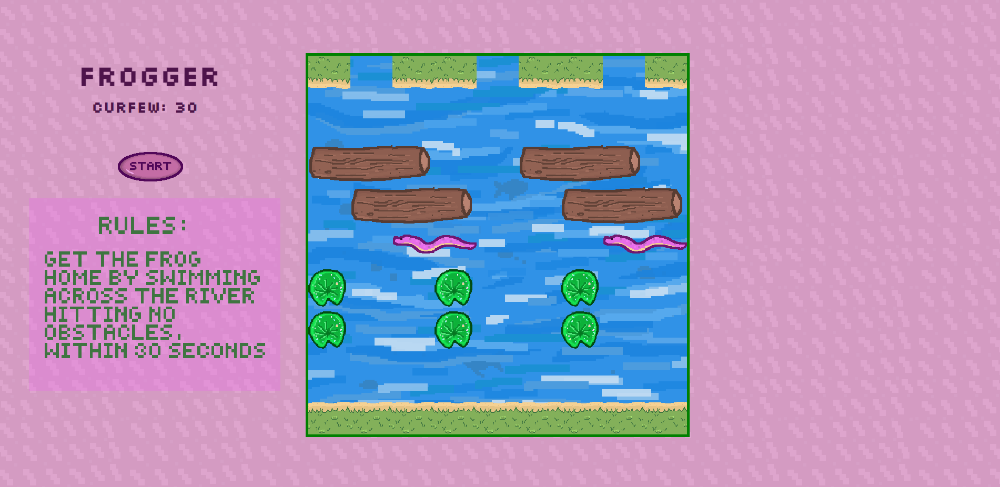
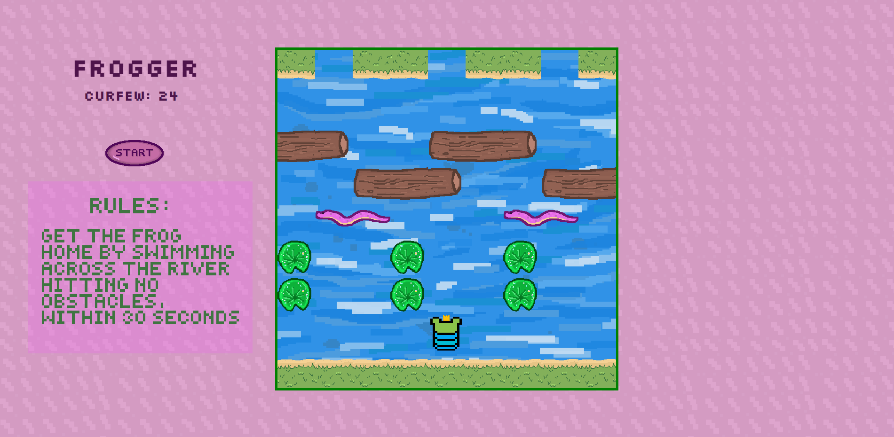

# FROGGER
## Project Description
Browser-based clone of the 1981 arcade game Frogger. The object of the game is to place the frog in one of the three 'home' spaces across the hazardous river within the 30-second curfew. This frog's got some **strict** parents! 

I Illustrated this entire game myself, *except* for the body of the frog. This was borrowed from [Pixelart's](https://www.pixilart.com/) stamp tool.

## Getting Started- Take a *leap* and see if you can make it home on time!
Instructions: Use WASD (up, left, down, right) keys to hop around obtacles and win by entering the patches of water across the river before the timer runs out.
*Ready?*
[Play Frogger.](https://estrellaalvarez.github.io/Frogger/)

## Screenshots
### Main Page:

### Active Page:

### Loss Page:

### Win Page:

## Technologies Used:
JavaScript, HTML, and CSS.

## Next Steps
My future improvments for this game include:
* The current state of this game lies around medium difficulty. I'd like to implement an "Easy" and "Hard" difficulty setting.
* Creating and keeping high scores
* Creating a "lives" system
* Ability to ride along on lilypads